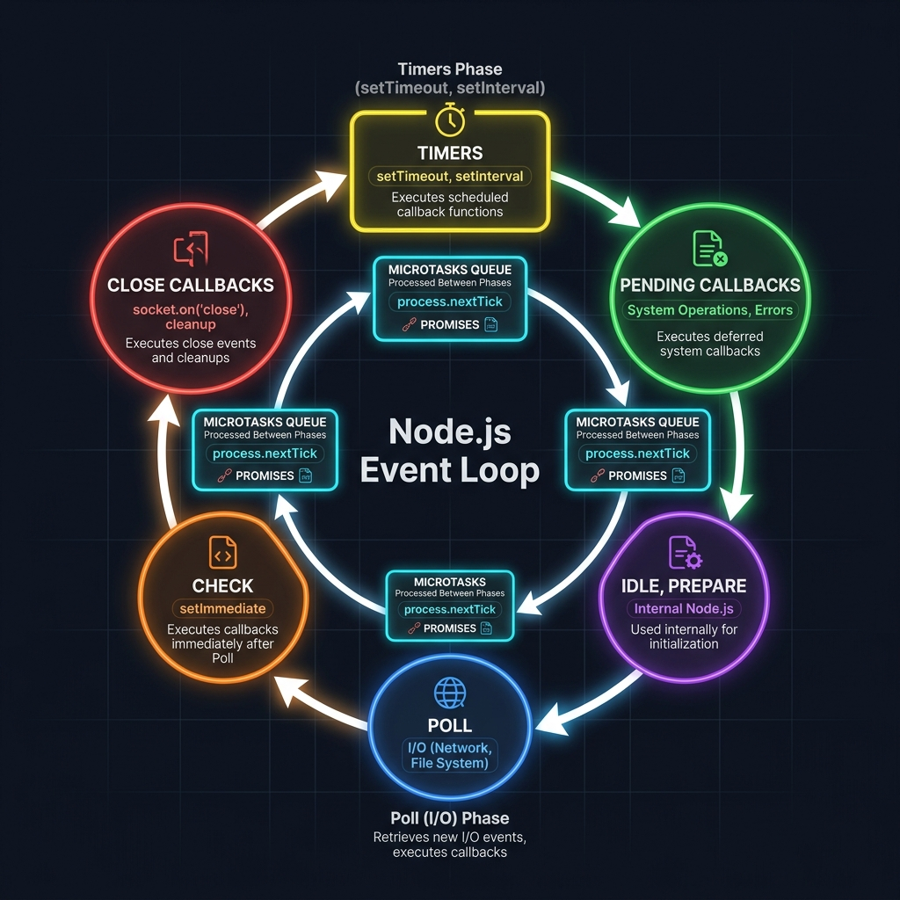

#  Brush up your JavaScript knowledge for your 2023 interview with this list of 75+ frequently asked questions


## Table of Contents
<div id="top"></div>

- [1. What is Javascript ?](#q1)
- [2. What is Key Features of Javascript ?](#q2)
- [3. What are the data types in JavaScript ?](#q3)
- [4. What is the difference between null and undefined in JavaScript ?](#q4)
- [5. What is NaN in JavaScript?](#q5)
- [6. What is the difference between Primitive and Non-primitive data types in JavaScript?](#q6)
- [7. What is the difference between == and === in JavaScript?](#q7)
- [8. What is the difference between synchronous and asynchronous code in JavaScript?](#q8)
- [9. What is the difference between let ,var and const in JavaScript?](#q9)
- [10. What is the difference between null and undefined in JavaScript?](#q10)
- [11. What is first class function?](#q11)
- [12. What is higher order function?](#q12)
- [13. What is first order function?](#q13)
- [14. What is Callback?](#q14)
- [15. Why we need a callback in javascript?](#q15)
- [16. What is the difference between shift and unshift in JavaScript?](#q16)
- [17. What is the difference between slice and splice in JavaScript?](#q17)
- [18. What is the difference between rest and spread in JavaScript?](#q18)
- [19. What is the difference between deep copy and shalow copy in JavaScript?](#q19)
- [20. What is the difference between call, apply and bind in JavaScript?](#q20)
- [21. What is local storage in JavaScript?](#q21)
- [22. What is session storage in JavaScript?](#q22)
- [23. What is the difference between local storage and session storage?](#q23)
- [24. What is the difference between cookies and local storage?](#q24)
- [25. How can you ensure that local storage data is not lost if the user clears their browser cache?](#q25)
- [26. What is the difference between synchronous and asynchronous storage operations in JavaScript?](#q26)
- [27. How do you handle errors when working with local storage in JavaScript?](#q27)
- [28. How do you synchronize local storage data between multiple devices?](#q28)
- [29. What is browser caching and how does it work?](#q29)
- [30. What is the difference between first-party cookies and third-party cookies?](#q30)
- [31. How do you set and read cookies in JavaScript?](#q31)
- [32. What is the typeof null in JavaScript?](#q32)
- [33. What is the void operator in JavaScript and how is it used?](#q33)
- [34. What is the typeof NaN in JavaScript?](#q34)
- [35. How do you concatenate two strings in JavaScript?](#q35)
- [36. How do you replace a substring within a string in JavaScript?](#q36)
- [37. What is the DOM in JavaScript?](#q37)
- [38. How do you access an element in the DOM using JavaScript?](#q38)
- [39. What is the difference between innerHTML and textContent in JavaScript?](#q39)
- [40. What is the difference between getElementsByClassName() and querySelectorAll() methods?](#q40)
- [41. How do you perform form validation in JavaScript?](#q41)
- [42. How do you prevent SQL injection attacks in JavaScript?](#q42)
- [43. What is client-side validation in JavaScript?](#q43)
- [44. What is a Promise in JavaScript?](#q44)
- [45. What are the states of a Promise?](#q45)
- [46. How do you create a Promise in JavaScript?](#q46)
- [47. How do you handle a successful Promise?](#q47)
- [48. How do you handle a failed Promise?](#q48)
- [49. How do you handle multiple Promises simultaneously?](#q49)
- [50. What is the difference between Promise.all() and Promise.race()?](#q50)
- [51. What is Promise chaining?](#q51)
- [52. What is the difference between Promises and callbacks?](#q52)
- [53. How do you convert a callback function to a Promise?](#q53)
- [54. What is the difference between a synchronous and asynchronous callback in JavaScript?](#q54)
- [55. How many types of error in javascript?](#q55)
- [56. Difference between undefined and not defined ?](#q56)
- [57. What is Template literal in javascript?](#q57)
- [58. What is polyfill?](#q58)
- [59. Give an example of an Anonymous function?](#q59)
- [60. What is Prototype Property? Explain with an Example.](#q60)
- [61. Give a list of the various ways using which an HTML element can be accessed within a JavaScript code?](#q61)
- [62. Which keyword can be used to deploy inheritance in ES6?](#q62)
- [63. What's the difference between a function expression and function declaration?](#q63)
- [64. Explain the difference between Object.freeze() vs const?](#q64)
- [65. What is the difference between Microtasks and Macrotasks in the Event Loop?](#q65)
- [66. Explain how Garbage Collection works in V8 (Orinoco, Scavenger, Mark-Sweep)?](#q66)
- [67. What is the difference between Map and WeakMap? Give a real-world use case.](#q67)
- [68. What are Proxy and Reflect? How can they be used for data validation or observation?](#q68)
- [69. Explain "Currying" and "Partial Application" with examples.](#q69)
- [70. How do you identify and prevent memory leaks in a JavaScript application?](#q70)
- [71. What is the difference between shallow copy and deep copy using structuredClone?](#q71)
- [72. Deep Dive: What is the Node.js Event Loop and how does it work?](#q72)
- [73. What is process.nextTick() and how does it differ from setImmediate()?](#q73)
- [74. What is "Backpressure" in Node.js Streams and how do you handle it?](#q74)
- [75. When should you use Worker Threads over Child Processes?](#q75)
- [76. Explain the Cluster module and how it enables load balancing.](#q76)
- [77. What is a Buffer in Node.js and why is it used for binary data?](#q77)
- [78. How do you handle "CORS" in a Node.js Express application?](#q78)
- [79. How do you perform "Heap Profiling" to find memory leaks in Node.js?](#q79)


<div id="q1"></div>

## 1. What is Javascript ? [&uarr; Top](#top)
JavaScript is a high-level, <b>interpreted programming</b>  language that is widely used for building dynamic web pages and applications. It was created in 1995 by <b>Brendan Eich</b>, then an employee of Netscape Communications Corporation, and it has since become one of the most popular programming languages in the world.

JavaScript is often used in conjunction with HTML and CSS to create interactive web pages and web applications. It runs on the client-side of the web, meaning it executes in the user's browser, as well as on the server-side using platforms such as Node.js.

JavaScript is a versatile language that supports multiple programming paradigms, including object-oriented, functional, and procedural programming. It also has a vast ecosystem of libraries and frameworks, such as React, Vue, Angular, and jQuery, which make it easier to develop complex web applications

<div id="q2"></div>

## 2. What is Key Features of Javascript ? [&uarr; Top](#top)
- **Dynamic Typing:** JavaScript is a dynamically-typed language, which means that variable types are determined at runtime rather than being declared explicitly in the code.

- **First-class Functions:** Functions in JavaScript are treated as first-class citizens, which means they can be passed around as arguments to other functions, returned as values from functions, and stored in variables.

- **Closures:** Closures are a powerful feature of JavaScript that allow functions to access variables from an outer function that has already returned. This makes it possible to create private variables and methods within a function.

- **Prototypal Inheritance:** JavaScript uses prototypal inheritance, which allows objects to inherit properties and methods from their parent objects. This makes it possible to create complex object hierarchies and reuse code in a more efficient way.

- **Event-driven programming:** JavaScript is often used for event-driven programming, where code is executed in response to events such as user input, page loads, or timer events.

- **Asynchronous Programming:** JavaScript has built-in support for asynchronous programming, which means that code can execute in a non-blocking way. This is particularly useful for tasks such as fetching data from a server or performing complex calculations that might otherwise freeze the user interface.

- **DOM Manipulation:** JavaScript is widely used for manipulating the Document Object Model (DOM) in web pages, which allows developers to create dynamic and interactive user interfaces.

<div id="q3"></div>

## 3. What are the data types in JavaScript ? [&uarr; Top](#top)
JavaScript supports several data types, including numbers, strings, booleans, null, undefined, objects, and symbols.

<div id="q4"></div>

## 4. What is the difference between null and undefined in JavaScript ? [&uarr; Top](#top)
null represents the intentional absence of any object value, while undefined represents the absence of a defined value.

<div id="q5"></div>

## 5. What is NaN in JavaScript? [&uarr; Top](#top)
NaN stands for "Not a Number," and it is a value that is returned when a mathematical operation that cannot be performed is attempted.

<div id="q6"></div>

## 6. What is the difference between Primitive and Non-primitive data types in JavaScript? [&uarr; Top](#top)
The main difference between primitive and non-primitive data types in JavaScript is that primitive data types store a single value like let, string, boolean, undefined and null while non-primitive data types can store multiple values and methods like object, date, RegExp and function. Additionally, primitive data types are immutable, while non-primitive data types are mutable

<div id="q7"></div>

## 7. What is the difference between == and === in JavaScript? [&uarr; Top](#top)
The double equals (==) operator checks for equality after converting both values to a common type. The triple equals (===) operator checks for equality without performing any type conversions.

<div id="q8"></div>

## 8. What is the difference between synchronous and asynchronous code in JavaScript?  [&uarr; Top](#top)
Synchronous code is executed in a sequential manner, where each line of code must finish executing before the next line is executed. Asynchronous code, on the other hand, allows multiple things to happen at the same time.

<div id="q9"></div>

## 9. What is the difference between let ,var and const in JavaScript?[&uarr; Top](#top)
**var**: The 'var' keyword was the only way to declare a variable prior to the release of ES6 (ECMAScript 2015). It declares a variable globally or locally to an entire function regardless of block scope. However, 'var' does not support block-scoping, which means that a variable declared with 'var' inside a block will be visible outside that block. Also, a variable declared with 'var' can be re-declared and updated.

**let:** The 'let' keyword is used to declare block-scoped variables. A variable declared with 'let' is only accessible within the block scope it was declared in, including any nested blocks. Also, 'let' variables can be updated but not re-declared.

**const:** The 'const' keyword is used to declare variables that cannot be reassigned a new value. Variables declared with 'const' are also block-scoped.

<div id="q10"></div>

## 10. What is the difference between null and undefined in JavaScript?[&uarr; Top](#top)
**undefined** is a primitive data type that is automatically assigned to a variable that has been declared but not yet assigned a value. It is also the default return value of a function that does not return a value. For example:
```javascript
let x;
console.log(x); // Output: undefined

function foo() {}
console.log(foo()); // Output: undefined

```
On the other hand, **null** is a value that represents the intentional absence of any object value. It is often used to indicate that a variable has no value, or that a function should return no value. For example:
```javascript
let y = null;
console.log(y); // Output: null

function bar() {
  return null;
}
console.log(bar()); // Output: null

```

<div id="q11"></div>

## 11. What is first class function?[&uarr; Top](#top)
In JavaScript, functions are considered first-class citizens, which means that they can be treated like any other value. This includes being assigned to variables, passed as arguments to other functions, and returned as values from functions. A function that can be assigned to a variable, passed as an argument, or returned from a function is called a first-class function.

Here is an example of a first-class function in JavaScript:
```javascript
function add(a, b) {
  return a + b;
}

const result = add(2, 3); // result is 5

const sum = add; // assigning the function to a variable

const newResult = sum(4, 5); // newResult is 9

```


<div id="q12"></div>

## 12. What is higher order function? [&uarr; Top](#top)
In JavaScript, a higher-order function is a function that takes one or more functions as arguments, and/or returns a function as its result. Higher-order functions are a powerful feature of the language, as they enable functional programming paradigms and allow for code that is more modular, reusable, and expressive.

Here is an example of a higher-order function in JavaScript:
```javascript
function multiplyBy(factor) {
  return function(number) {
    return number * factor;
  }
}

const double = multiplyBy(2);
const triple = multiplyBy(3);

console.log(double(5)); // 10
console.log(triple(5)); // 15

```

<div id="q13"></div>

## 13. What is first order function? [&uarr; Top](#top)
In JavaScript, a first-order function is a function that doesn't take any functions as arguments and doesn't return a function as its result. In other words, a first-order function is a simple function that takes only primitive data types (like strings, numbers, and booleans) as arguments and returns a value of a primitive data type.

Here's an example of a first-order function in JavaScript:
```javascript
function addNumbers(a, b) {
  return a + b;
}

```

<div id="q14"></div>

## 14. What is Callback?[&uarr; Top](#top)
A callback is a function that is passed as an argument to another function and is executed when that function has completed its operation.

Callbacks are commonly used in asynchronous programming, where a function does not block the execution of the program but instead returns immediately, allowing other code to be executed while it waits for a response. When the response is received, the callback function is called to handle the data

<div id="q15"></div>

## 15.Why we need a callback in javascript? [&uarr; Top](#top)
Callbacks are a fundamental concept in JavaScript, and they are used extensively in asynchronous programming. Here are a few reasons why callbacks are important in JavaScript:

**Handling Asynchronous Operations:** JavaScript is often used for programming applications that rely on asynchronous operations, such as network communication, file input/output, and user interface events. Using callbacks allows us to write code that can execute non-blocking operations and still be notified when those operations complete.

**Passing Functions as Arguments:** JavaScript allows functions to be passed as arguments to other functions, which means that we can create more flexible and reusable code by passing different functions as callbacks depending on the situation.

**Event Handling:** JavaScript can be used to handle user interface events, such as button clicks, mouse movements, and keyboard input. Callbacks are often used to handle these events, allowing the application to respond to user input in real-time.

**Control Flow:** Callbacks can be used to control the flow of execution in a program, allowing us to create complex sequences of operations that execute in a specific order.

<div id="q16"></div>

## 16. What is the difference between shift and unshift in JavaScript? [&uarr; Top](#top)
**shift()** method removes the first element from an array and returns it. This means that the array is modified and its length is reduced by one.
Here's an example:
```javascript
const arr = [1, 2, 3];
const firstElement = arr.shift(); // firstElement = 1, arr = [2, 3]

```
**unshift()** method adds one or more elements to the beginning of an array and returns the new length of the array. This means that the original array is modified and new elements are added to the beginning of the array.
```javascript
const arr = [2, 3];
const newLength = arr.unshift(1); // newLength = 3, arr = [1, 2, 3]

```

<div id="q17"></div>

## 17. What is the difference between slice and splice in JavaScript? [&uarr; Top](#top)

**slice()** method returns a new array that contains a copy of a portion of the original array. The original array is not modified.
Here's an example:
```javascript
const arr = [1, 2, 3, 4, 5];
const sliced = arr.slice(1, 4); // sliced = [2, 3, 4], arr = [1, 2, 3, 4, 5]

```
**The slice()** method takes two arguments: start and end, which are optional. If start is not specified, the slice starts from the beginning of the array. If end is not specified, the slice ends at the end of the array.

splice() method changes the contents of an array by removing or replacing existing elements and/or adding new elements. This means that the original array is modified.
Here's an example:
```javascript
const arr = [1, 2, 3, 4, 5];
const spliced = arr.splice(2, 2, 6, 7); // spliced = [3, 4], arr = [1, 2, 6, 7, 5]

```

<div id="q18"></div>

## 18. What is the difference between rest and spread in JavaScript? [&uarr; Top](#top)
In JavaScript, both rest and spread are features of the ES6 (ECMAScript 2015) specification that enable more flexible handling of arrays and objects.

**Rest** is used to represent an indefinite number of arguments as an array. It is denoted by an ellipsis ... before the name of a parameter in a function definition, indicating that any number of additional arguments can be passed in as an array.
Here's an example:
```javascript
function sum(...numbers) {
  return numbers.reduce((total, number) => total + number);
}

sum(1, 2, 3, 4); // returns 10

```
**Spread** is used to spread the elements of an array or an object into another array or object. It is also denoted by an ellipsis ..., but in this case it is used before an array or an object to spread its elements.
```javascript
const arr1 = [1, 2, 3];
const arr2 = [4, 5, 6];
const mergedArray = [...arr1, ...arr2]; // mergedArray = [1, 2, 3, 4, 5, 6]

```


<div id="q19"></div>

## 19. What is the difference between deep copy and shalow copy in JavaScript? [&uarr; Top](#top)
In JavaScript, when you create a copy of an object or an array, there are two ways to do it: deep copy and shallow copy.

**Shallow copy** creates a new object or array, but its properties or elements still point to the same memory location as the original object or array. This means that changes made to the original object or array will also affect the copied object or array.
Here's an example:
```javascript
const original = {a: {b: 1}};
const copied = Object.assign({}, original);

original.a.b = 2;

console.log(original.a.b); // outputs 2
console.log(copied.a.b); // outputs 2 as well, because the objects are sharing the same reference

```
In the above example, copied is a shallow copy of original, so changes made to the original object also affect the copied object.

**Deep copy** creates a new object or array and also copies all nested objects or arrays, so that the copied object or array is completely independent from the original object or array.
Here's an example:
```javascript
const original = {a: {b: 1}};
const copied = JSON.parse(JSON.stringify(original));

original.a.b = 2;

console.log(original.a.b); // outputs 2
console.log(copied.a.b); // outputs 1, because the objects are completely independent

```
In the above example, copied is a deep copy of original, so changes made to the original object do not affect the copied object.

So, the main difference between deep copy and shallow copy is that deep copy creates a completely independent copy of the original object or array, while shallow copy only creates a new object or array that shares some of the properties or elements with the original object or array.

<div id="q20"></div>

## 20. What is the difference between call, apply and bind in JavaScript? [&uarr; Top](#top)
In JavaScript, call, apply, and bind are methods that allow you to set the this value for a function and pass in arguments in different ways.

call and apply are used to call a function immediately, while bind returns a new function with the this value and some arguments pre-set.
Here are the differences between them:

**call:**
The call() method allows you to call a function with a given this value and arguments provided as a list (comma-separated). Here's an example:
```javascript
const person = {
  name: "John",
  age: 30,
  greet: function() {
    console.log(`Hi, my name is ${this.name} and I am ${this.age} years old.`);
  }
};

const employee = {
  name: "Jane",
  age: 25
};

person.greet.call(employee); // outputs "Hi, my name is Jane and I am 25 years old."

```
In the above example, call() is used to call the greet() function with the employee object as the this value.

**apply:**
The apply() method is similar to call(), but the arguments are passed in as an array. Here's an example:
```javascript
const numbers = [1, 2, 3, 4, 5];

const sum = function() {
  return Array.prototype.reduce.call(arguments, (total, number) => total + number);
};

const result = sum.apply(null, numbers);

console.log(result); // outputs 15

```
In the above example, apply() is used to call the sum() function with the numbers array as the argument list.

**bind:**
The bind() method returns a new function with the this value and some arguments pre-set. Here's an example:
```javascript
const person = {
  name: "John",
  age: 30,
  greet: function(greeting) {
    console.log(`${greeting}, my name is ${this.name} and I am ${this.age} years old.`);
  }
};

const employee = {
  name: "Jane",
  age: 25
};

const greetEmployee = person.greet.bind(employee, "Hello");

greetEmployee(); // outputs "Hello, my name is Jane and I am 25 years old."

```
In the above example, bind() is used to create a new function greetEmployee with the employee object as the this value and "Hello" as the first argument.

So, the main difference between call(), apply(), and bind() is the way they pass arguments to the function and the way they set the this value.


<div id="q21"></div>

## 21. What is local storage in JavaScript? [&uarr; Top](#top)
Local storage is a type of storage in JavaScript that allows web developers to store data within a user's browser. It is a key-value store, meaning that data is stored as a pair of key and value. Local storage data persists even after the user closes the browser window


<div id="q22"></div>

## 22. What is session storage in JavaScript? [&uarr; Top](#top)
Session storage is another type of storage in JavaScript that allows web developers to store data within a user's browser. Unlike local storage, session storage data is stored only for the duration of the user's browser session, meaning that the data is lost when the user closes the browser window


<div id="q23"></div>

## 23. What is the difference between local storage and session storage? [&uarr; Top](#top)
The main difference between local storage and session storage is that local storage data persists even after the user closes the browser window, while session storage data is lost when the user closes the browser window

<div id="q24"></div>

## 24. What is the difference between cookies and local storage? [&uarr; Top](#top)
Cookies are small text files that are stored on a user's device by a website, while local storage is a type of storage in JavaScript that allows web developers to store data directly in a user's browser. Cookies are typically used for authentication and tracking, while local storage is used for storing user-specific data such as preferences and settings.

<div id="q25"></div>

## 25. How can you ensure that local storage data is not lost if the user clears their browser cache? [&uarr; Top](#top)
Local storage data is typically not cleared when a user clears their browser cache, but it may be cleared if the user clears their browser data or if the storage quota is exceeded. To ensure that local storage data is not lost, you can periodically backup the data to a server or use other storage options such as cookies or indexedDB

<div id="q26"></div>

## 26. What is the difference between synchronous and asynchronous storage operations in JavaScript? [&uarr; Top](#top)
Synchronous storage operations in JavaScript block the main thread of the browser until the operation is complete, while asynchronous storage operations allow other code to continue running while the operation is being performed. Asynchronous storage operations are generally preferred because they provide a better user experience and prevent the browser from freezing or becoming unresponsive


<div id="q27"></div>

## 27. How do you handle errors when working with local storage in JavaScript? [&uarr; Top](#top)
When working with local storage in JavaScript, you should always check for errors and handle them appropriately. Common errors include exceeding the storage quota, invalid data types, and security violations. You can use try-catch blocks or error handling functions to catch and handle these errors.

<div id="q28"></div>

## 28. How do you synchronize local storage data between multiple devices? [&uarr; Top](#top)
Synchronizing local storage data between multiple devices can be challenging, as local storage data is specific to a single browser on a single device. To synchronize data between devices, you can use a server-side database or cloud storage service, or you can use a third-party library or framework that provides synchronization functionality

<div id="q29"></div>

## 29. What is browser caching and how does it work?  [&uarr; Top](#top)
Browser caching is a process by which a browser stores a copy of a webpage or other web content on the user's device so that it can be quickly retrieved and displayed the next time the user visits the same page. When a user requests a page for the first time, the browser downloads all of the necessary resources (HTML, CSS, JavaScript, images, etc.) and stores them in its cache. The next time the user visits the same page, the browser checks its cache first and retrieves the resources from there if they have not expired or been modified


<div id="q30"></div>

## 30. What is the difference between first-party cookies and third-party cookies? [&uarr; Top](#top)
First-party cookies are created and used by the website that the user is visiting, while third-party cookies are created and used by a domain other than the one that the user is visiting. Third-party cookies are often used for tracking and advertising purposes, and have been the subject of privacy concerns in recent years.

<div id="q31"></div>

## 31. How do you set and read cookies in JavaScript? [&uarr; Top](#top)
To set a cookie in JavaScript, you can use the document.cookie property, which allows you to set a string in the format key=value. For example, document.cookie = 'username=john'; will set a cookie named 'username' with the value 'john'. To read a cookie, you can use the document.cookie property to get a string of all the cookies, and then parse the string to find the cookie you are looking for.

<div id="q32"></div>

## 32. What is the typeof null in JavaScript? [&uarr; Top](#top)
The typeof null is a quirk of JavaScript, and returns 'object'. This is because null is often used to represent an empty object, but is not actually an object itself.

<div id="q33"></div>

## 33. What is the void operator in JavaScript and how is it used? [&uarr; Top](#top)
The void operator is used to evaluate an expression and return undefined. It is often used in situations where a statement needs to be evaluated but no value is needed or desired. For example, void console.log('Hello, world!') would log the string 'Hello, world!' to the console, but would return undefined

<div id="q34"></div>

## 34. What is the typeof NaN in JavaScript? [&uarr; Top](#top)
The typeof NaN in JavaScript returns 'number', which can be confusing since NaN is not a valid number. NaN stands for "Not a Number", and is often the result of mathematical operations that do not have a valid result, such as dividing by zero or performing arithmetic with non-numeric values.

<div id="q35"></div>

## 35. How do you concatenate two strings in JavaScript? [&uarr; Top](#top)
Answer: Two strings can be concatenated in JavaScript using the + operator. For example, var myString = 'hello' + 'world'; console.log(myString); will output 'helloworld'.

<div id="q36"></div>

## 36. How do you replace a substring within a string in JavaScript? [&uarr; Top](#top)
Answer: A substring can be replaced within a string in JavaScript using the replace() method. For example, var myString = 'hello world'; console.log(myString.replace('world', 'universe')); will output 'hello universe'

<div id="q37"></div>

## 37. What is the DOM in JavaScript? [&uarr; Top](#top)
The Document Object Model (DOM) is a programming interface for web documents that provides a hierarchical representation of the HTML or XML document. It allows programmers to access and manipulate the content and structure of a web page using JavaScript

<div id="q38"></div>

## 38. How do you access an element in the DOM using JavaScript? [&uarr; Top](#top)
You can access an element in the DOM using JavaScript by using the document.getElementById() method, which returns a reference to the element with the specified ID.

<div id="q39"></div>

## 39. What is the difference between innerHTML and textContent in JavaScript? [&uarr; Top](#top)
innerHTML sets or returns the HTML content inside an element, while textContent sets or returns the text content of an element, without any HTML tags.

<div id="q40"></div>

## 40. What is the difference between getElementsByClassName() and querySelectorAll() methods? [&uarr; Top](#top)
The getElementsByClassName() method returns a live HTMLCollection of elements with the specified class name, while the querySelectorAll() method returns a non-live NodeList of elements that match a specified CSS selector.

<div id="q41"></div>

## 41. How do you perform form validation in JavaScript? [&uarr; Top](#top)
You can perform form validation in JavaScript by using the submit event to check the form data, and displaying error messages if the data is invalid.

<div id="q42"></div>

## 42. How do you prevent SQL injection attacks in JavaScript? [&uarr; Top](#top)
You can prevent SQL injection attacks in JavaScript by using prepared statements and parameterized queries, and by escaping special characters in user input.

<div id="q43"></div>

## 43. What is client-side validation in JavaScript? [&uarr; Top](#top)
Client-side validation is the process of validating user input on the client-side, before the form is submitted to the server.

<div id="q44"></div>

## 44. What is a Promise in JavaScript? [&uarr; Top](#top)
In JavaScript, a Promise is an object that represents the eventual completion (or failure) of an asynchronous operation and its resulting value. Promises were introduced in ECMAScript 2015 (ES6) to simplify asynchronous programming and make it easier to handle complex asynchronous operations, such as fetching data from a server or reading files.

A Promise can be in one of three states:

**Pending:** The initial state when the Promise is created and the asynchronous operation is still ongoing.
**Fulfilled:** The state when the asynchronous operation is successful, and the Promise resolves with a value.
**Rejected:** The state when the asynchronous operation encounters an error or fails, and the Promise rejects with a reason (error).
A Promise can transition from pending to either fulfilled or rejected but cannot change its state once settled (fulfilled or rejected).

<div id="q45"></div>

## 45. What are the states of a Promise? [&uarr; Top](#top)
A Promise can be in one of three states: Pending (initial state), Fulfilled (meaning the operation completed successfully), or Rejected (meaning it failed).

<div id="q46"></div>

## 46. How do you create a Promise in JavaScript? [&uarr; Top](#top)
n JavaScript, you can create a Promise using the Promise constructor. The Promise constructor takes a single argument, which is a function called the "executor." The executor function takes two parameters: resolve and reject. These parameters are functions that you call to either fulfill the Promise (resolve) or reject it (reject).

Here's the basic syntax for creating a Promise.
```javascript
const myPromise = new Promise((resolve, reject) => {
  // Asynchronous operation or task here
  // If the operation is successful, call 'resolve' with the result
  // If there is an error, call 'reject' with an error object or message
});

```

<div id="q47"></div>

## 47. How do you handle a successful Promise? [&uarr; Top](#top)
To handle a successful Promise, you use the .then() method. The .then() method is used to specify a callback function that will be executed when the Promise is fulfilled (resolved) successfully. The function inside .then() will receive the resolved value as its argument.
```javascript
myPromise.then((resolvedValue) => {
  // Code to handle the successful resolution
});

```

<div id="q48"></div>

## 48. How do you handle a failed Promise? [&uarr; Top](#top)
To handle a failed Promise, you use the .catch() method. The .catch() method is used to specify a callback function that will be executed when the Promise is rejected. The function inside .catch() will receive the reason for the rejection (usually an error) as its argument.

Here's the basic syntax for handling a failed Promise using .catch():
```javascript
myPromise.catch((error) => {
  // Code to handle the error or rejection reason
});

```

<div id="q49"></div>

## 49. How do you handle multiple Promises simultaneously? [&uarr; Top](#top)
Handling multiple Promises simultaneously is a common scenario in asynchronous programming when you need to execute multiple asynchronous operations in parallel and wait for all of them to complete before performing further actions. JavaScript provides several approaches to handle multiple Promises simultaneously:

**Promise.all():** The Promise.all() method takes an array of Promises as its argument and returns a new Promise that is fulfilled with an array of resolved values when all the input Promises are fulfilled. If any of the input Promises is rejected, the returned Promise will be rejected with the reason of the first rejected Promise.
```javascript
const promise1 = fetchDataFromAPI1();
const promise2 = fetchDataFromAPI2();
const promise3 = fetchDataFromAPI3();

Promise.all([promise1, promise2, promise3])
  .then((results) => {
    // All Promises fulfilled, and results is an array containing the resolved values
    console.log('Data fetched successfully:', results);
  })
  .catch((error) => {
    // If any of the Promises is rejected, this block will handle the error
    console.error('Error fetching data:', error.message);
  });

```
**Promise.allSettled():** The Promise.allSettled() method is similar to Promise.all(), but it waits for all the input Promises to settle (fulfilled or rejected) before returning a Promise. The resulting Promise is fulfilled with an array of objects, each representing the outcome of the corresponding input Promise.
```javascript
const promise1 = fetchDataFromAPI1();
const promise2 = fetchDataFromAPI2();
const promise3 = fetchDataFromAPI3();

Promise.allSettled([promise1, promise2, promise3])
  .then((results) => {
    // All Promises settled, and results is an array containing objects with status and value/reason
    console.log('Results:', results);
  });

```
**Promise.race():** The Promise.race() method takes an array of Promises as its argument and returns a new Promise that is fulfilled or rejected with the value or reason of the first settled Promise (either fulfilled or rejected).
```javascript
const promise1 = fetchDataFromAPI1();
const promise2 = fetchDataFromAPI2();
const promise3 = fetchDataFromAPI3();

Promise.race([promise1, promise2, promise3])
  .then((result) => {
    // The first Promise to settle (fulfilled or rejected) will be handled here
    console.log('First Promise settled:', result);
  });

```

<div id="q50"></div>

## 50. What is the difference between Promise.all() and Promise.race()? [&uarr; Top](#top)
**Promise.all()** waits for all input Promises to fulfill before resolving its returned Promise or rejecting it if any of the input Promises is rejected.

**Promise.race()** resolves or rejects its returned Promise with the value or reason of the first settled Promise (the first Promise to fulfill or reject) in the input array.

<div id="q51"></div>

## 51. What is Promise chaining? [&uarr; Top](#top)
Promise chaining is the practice of using the return value of one Promise as the input for another, allowing you to chain multiple asynchronous operations together.

<div id="q52"></div>

## 52. What is the difference between Promises and callbacks? [&uarr; Top](#top)
Promises are more powerful and flexible than callbacks because they can handle both success and failure, can be chained, and have methods for handling multiple Promises at once.

<div id="q53"></div>

## 53. How do you convert a callback function to a Promise? [&uarr; Top](#top)
To convert a callback function to a Promise, you can wrap the callback-based function in a new function that returns a Promise. This process is called "promisification." The basic idea is to create a new Promise and use the callback function's success and error paths (i.e., the callback's resolve and reject) to fulfill or reject the Promise.

Here's the general approach:

- Create a new function that takes the same arguments as the original callback function.
- Inside the new function, return a new Promise.
- Within the Promise executor function, call the original callback function with appropriate resolve and reject handlers.
- Handle the successful or error outcome in the resolve and reject handlers and fulfill or reject the Promise accordingly.

Let's convert a callback-based function, fetchDataWithCallback, to a Promise-based function, fetchDataWithPromise:
```javascript
// Callback-based function
function fetchDataWithCallback(callback) {
  // Simulating an asynchronous operation
  setTimeout(() => {
    const data = { name: 'John', age: 30 };
    callback(null, data); // Call the callback with the result (null for error)
  }, 2000);
}

// Promise-based function (promisification)
function fetchDataWithPromise() {
  return new Promise((resolve, reject) => {
    fetchDataWithCallback((error, data) => {
      if (error) {
        reject(error); // Reject the Promise with the error from the callback
      } else {
        resolve(data); // Resolve the Promise with the data from the callback
      }
    });
  });
}

```

<div id="q54"></div>

## 54. What is the difference between a synchronous and asynchronous callback in JavaScript?	[&uarr; Top](#top)
A synchronous callback is executed immediately by the calling function and blocks further execution until it is complete. An asynchronous callback is executed later, after some other operation has completed, and does not block further execution. Asynchronous callbacks are often used for non-blocking operations, such as AJAX requests or timeouts.

<div id="q55"></div>

## 55. How many types of error in javascript? [&uarr; Top](#top)
In JavaScript, there are several types of errors that can occur during the execution of a program. These errors are called "runtime errors" or "exceptions," and they indicate that something unexpected or incorrect has happened during the program's execution. Some common types of errors in JavaScript include:

**SyntaxError:** This occurs when the code has a syntax error, such as missing parentheses, semicolons, or other syntax rules violations.

**ReferenceError:** This occurs when the code tries to access a variable or function that does not exist or is not in scope.

**TypeError:** This occurs when the code attempts to perform an operation on a value of an inappropriate data type or when trying to access properties or methods on non-object values.

**RangeError:** This occurs when a numeric value is not in the expected range. For example, calling a function with too many arguments or using an invalid array length.

**EvalError:** This error is deprecated and was used when there was an issue with the eval() function.

**InternalError:** This represents an error that occurs internally in the JavaScript engine, usually when a limit is exceeded, such as the maximum call stack size in recursive functions.

**URIError:** This occurs when encoding or decoding functions (e.g., encodeURIComponent, decodeURIComponent, encodeURI, decodeURI) encounter invalid characters or incorrect use.

**Network Errors:** These are errors that occur when trying to fetch resources from external servers using XMLHttpRequest or Fetch API. Examples include 'NetworkError', 'TypeError', 'AbortError', etc

<div id="q56"></div>

## 56. Difference between undefined and not defined ? [&uarr; Top](#top)
**Undefined:** When a variable or identifier is declared but has not been assigned a value, it is said to have the value of "undefined." This means that the variable exists in the current scope, but it does not have any meaningful value assigned to it yet

**Not Defined:** When you attempt to access a variable or identifier that has not been declared in the current scope or any enclosing scope, it is said to be "not defined." This means that the variable does not exist in the program's scope.

<div id="q57"></div>

## 57. What is Template literal in javascript? [&uarr; Top](#top)
Template literals, introduced in ECMAScript 2015 (ES6), are a feature in JavaScript that allows you to create strings with embedded expressions. They are denoted using backticks ( ) instead of single or double quotes.

The syntax of a template literal is as follows:
```javascript
const variable = 'value';
const templateLiteral = `This is a template literal with ${variable} inside it.`;

```
<div id="q58"></div>

## 58. What is polyfill? [&uarr; Top](#top)
A "polyfill" in JavaScript is a piece of code (usually a JavaScript library or script) that provides modern functionality to older browsers or environments that do not support certain features of the latest JavaScript language or APIs. The term "polyfill" is a combination of "poly" (meaning many) and "fill," implying that it fills the gaps in functionality for older browsers.

When new features are introduced in JavaScript or web APIs, not all browsers may support them immediately. This can cause compatibility issues and prevent developers from using these new features in their code. Polyfills help bridge this gap by implementing the missing functionality using JavaScript, so that developers can use the latest features regardless of whether the browser natively supports them.

<div id="q59"></div>

## 59. Give an example of an Anonymous function? [&uarr; Top](#top)
```javascript
// Using an anonymous function as a callback
setTimeout(function() {
  console.log("This is an anonymous function being used as a callback.");
}, 1000);

// Using an anonymous function as a function expression
const addNumbers = function(a, b) {
  return a + b;
};

console.log(addNumbers(5, 10)); // Output: 15

```
<div id="q60"></div>

## 60. What is Prototype Property? Explain with an Example. [&uarr; Top](#top)
In JavaScript, every object has a special property called prototype, which allows objects to inherit properties and methods from other objects. The prototype property is used in the concept of prototypal inheritance, where objects can share common behavior through their prototypes.

Here's an example to illustrate the prototype property.
```javascript
// Constructor function for creating Person objects
function Person(name, age) {
  this.name = name;
  this.age = age;
}

// Adding a method to the prototype of the Person constructor
Person.prototype.sayHello = function() {
  console.log(`Hello, my name is ${this.name} and I am ${this.age} years old.`);
};

// Creating two Person objects using the 'new' keyword
const person1 = new Person('Alice', 30);
const person2 = new Person('Bob', 25);

// Calling the sayHello method on both objects
person1.sayHello(); // Output: Hello, my name is Alice and I am 30 years old.
person2.sayHello(); // Output: Hello, my name is Bob and I am 25 years old.

```
<div id="q61"></div>

## 61. Give a list of the various ways using which an HTML element can be accessed within a JavaScript code? [&uarr; Top](#top)
In JavaScript, there are several ways to access an HTML element from within your code. Here's a list of some common methods to do so

**getElementById:** This method retrieves an element by its unique ID attribute
```javascript
const elementById = document.getElementById('elementId');

```
**querySelector:** This method uses a CSS selector to select the first matching element.
```javascript
const elementByQuery = document.querySelector('css-selector');
```
**querySelectorAll:** This method selects all elements that match the given CSS selector and returns them in a NodeList (a collection similar to an array).
```javascript
const elementsByQueryAll = document.querySelectorAll('css-selector');
```
**getElementsByClassName**: This method returns a collection of elements that have a specific class name.
```javascript
const elementsByClassName = document.getElementsByClassName('className');
```
**getElementsByTagName:** This method returns a collection of elements that have a specific tag name.
```javascript
const elementsByTagName = document.getElementsByTagName('tagName');
```
**getElementsByName:** This method returns a collection of elements with a specific name attribute
```javascript
const elementsByName = document.getElementsByName('elementName');
```
<div id="q62"></div>

## 62. Which keyword can be used to deploy inheritance in ES6? [&uarr; Top](#top)
In ES6 (ECMAScript 2015) and later versions of JavaScript, the class keyword is used to deploy inheritance and create class-based objects with the concept of prototypal inheritance. ES6 introduced a more familiar and object-oriented syntax for creating classes and implementing inheritance.

Here's an example of how inheritance is achieved using the class keyword:
```javascript
// Parent class
class Animal {
  constructor(name) {
    this.name = name;
  }

  makeSound() {
    console.log("Some generic sound");
  }
}

// Child class inheriting from the Animal class
class Dog extends Animal {
  constructor(name, breed) {
    super(name); // Call the constructor of the parent class using 'super'
    this.breed = breed;
  }

  makeSound() {
    console.log("Woof woof!"); // Overriding the makeSound method of the parent class
  }
}

// Creating objects using the classes
const animal = new Animal("Generic Animal");
const dog = new Dog("Buddy", "Labrador");

console.log(animal.name); // Output: Generic Animal
animal.makeSound(); // Output: Some generic sound

console.log(dog.name); // Output: Buddy
console.log(dog.breed); // Output: Labrador
dog.makeSound(); // Output: Woof woof!
```
<div id="q63"></div>

## 63. What's the difference between a function expression and function declaration? [&uarr; Top](#top)
Function expression and function declaration are two different ways of creating functions in JavaScript. The main difference lies in how and when they are defined and hoisted in the code.

**Function Declaration:**
A function declaration is a statement that defines a named function using the function keyword. It has the following syntax:
```javascript
function functionName(parameters) {
  // Function body
  // Code logic
  return something;
}

```
**Function Expression:**
A function expression, on the other hand, is an assignment of a function to a variable. It has the following syntax
```javascript
const functionName = function(parameters) {
  // Function body
  // Code logic
  return something;
};

```
<div id="q64"></div>

## 64. Explain the difference between Object.freeze() vs const? [&uarr; Top](#top)
**const Keyword:**
The const keyword is used to declare variables with constant values. It ensures that the value of the variable cannot be reassigned after its initial assignment. This applies to primitive values as well as object references. However, const does not prevent the properties of an object from being modified if the object itself is mutable.

Example:
```javascript
const x = 5; // x is a constant
const obj = { key: "value" };
obj.key = "new value"; // This is allowed
```
**Object.freeze():**
Object.freeze() is a method provided by JavaScript that allows you to freeze an object, making it immutable. Once an object is frozen, its properties cannot be added, modified, or removed. Any attempts to modify a frozen object or its properties will result in an error (in strict mode) or be silently ignored (in non-strict mode).

Example
```javascript
const obj = { key: "value" };
Object.freeze(obj);
obj.key = "new value"; // This won't modify the object and will have no effect
```

<div id="q65"></div>

## 65. What is the difference between Microtasks and Macrotasks in the Event Loop? [&uarr; Top](#top)
In JavaScript, the Event Loop prioritizes tasks into two queues: **Microtasks** and **Macrotasks** (often just called Tasks).

- **Microtasks:** Have higher priority. They include `Promise.then`, `MutationObserver`, and in Node.js, `process.nextTick`. The microtask queue is emptied entirely after every single macrotask and before the next macrotask starts.
- **Macrotasks:** Include `setTimeout`, `setInterval`, `setImmediate`, I/O tasks, and UI rendering. Only one macrotask is processed from the queue in each iteration of the event loop.

**Execution Order:**
1. Execute a Macrotask (like the initial script).
2. Execute **all** available Microtasks.
3. Render UI (in browsers).
4. Move to the next Macrotask.

<div id="q66"></div>

## 66. Explain how Garbage Collection works in V8 (Orinoco, Scavenger, Mark-Sweep)? [&uarr; Top](#top)
V8 uses a generational garbage collection strategy to manage memory efficiently:

- **Young Generation (Scavenger):** Most objects die young. V8 allocates them in a small space called the "New Space". When it fills up, a "Scavenger" algorithm (Semi-space) quickly moves surviving objects to another half of the space or promotes them to the Old Space.
- **Old Generation (Full GC):** Objects that survive multiple scavenge cycles are moved here. V8 uses **Mark-Sweep** and **Mark-Compact** algorithms. It marks all reachable objects, then sweeps away the unreachable ones and compacts the memory to prevent fragmentation.
- **Orinoco:** The modern V8 GC project that implements parallel, incremental, and concurrent techniques to reduce "stop-the-world" pauses, keeping applications responsive.

<div id="q67"></div>

## 67. What is the difference between Map and WeakMap? Give a real-world use case. [&uarr; Top](#top)
- **Map:** Keys can be of any type (objects or primitives). It holds a **strong reference** to its keys, meaning as long as the Map exists, the keys cannot be garbage collected.
- **WeakMap:** Keys **must be objects**. It holds a **weak reference** to its keys. If there are no other references to a key object, it can be garbage collected even if it's still in the WeakMap. WeakMaps are not enumerable (no `size` or `forEach`).

**Use Case:**
Storing private metadata for objects without causing memory leaks. For example, associating temporary data with a DOM element: if the DOM element is removed from the document and has no other references, the associated data in the WeakMap will be automatically cleared.

<div id="q68"></div>

## 68. What are Proxy and Reflect? How can they be used for data validation or observation? [&uarr; Top](#top)
- **Proxy:** An object that wraps another object (target) and allows you to intercept and redefine fundamental operations (getting/setting properties, calling functions, etc.) using "traps".
- **Reflect:** A built-in object that provides methods for interceptable JavaScript operations. It’s often used inside Proxy traps to perform the default behavior on the target.

**Example (Validation):**
```javascript
const user = { name: "John", age: 25 };
const validator = new Proxy(user, {
  set(target, prop, value) {
    if (prop === 'age' && value < 0) {
      throw new Error("Age cannot be negative");
    }
    return Reflect.set(target, prop, value);
  }
});
```

<div id="q69"></div>

## 69. Explain "Currying" and "Partial Application" with examples. [&uarr; Top](#top)
- **Currying:** Transforming a function that takes multiple arguments into a sequence of functions that each take a **single** argument.
  ```javascript
  const sum = a => b => c => a + b + c;
  console.log(sum(1)(2)(3)); // 6
  ```
- **Partial Application:** Fixing a number of arguments to a function, producing another function of smaller arity.
  ```javascript
  const multiply = (a, b) => a * b;
  const double = multiply.bind(null, 2);
  console.log(double(5)); // 10
  ```

<div id="q70"></div>

## 70. How do you identify and prevent memory leaks in a JavaScript application? [&uarr; Top](#top)
**Identification:**
- Use Browser DevTools (Memory tab) to take heap snapshots and compare them.
- Look for a "sawtooth" pattern in memory usage.
- Use `Performance.measureUserAgentSpecificMemory()` in modern browsers.

**Prevention:**
1. **Clear Timers/Listeners:** Always `clearInterval` or `removeEventListener` when a component unmounts.
2. **Avoid Global Variables:** Variables attached to `window` stay in memory forever.
3. **Closures:** Be careful not to hold onto large objects in closures if they aren't needed.
4. **Weak References:** Use `WeakMap` or `WeakSet` for object-associated data.

<div id="q71"></div>

## 71. What is the difference between shallow copy and deep copy using structuredClone? [&uarr; Top](#top)
- **Shallow Copy (`{...obj}` or `Object.assign`):** Copies the top-level properties. Nested objects are still shared by reference.
- **Deep Copy (`JSON.parse(JSON.stringify(obj))`):** Creates a completely independent copy. However, it fails with Functions, Dates, Undefined, Infinity, and Circular References.
- **`structuredClone()`:** A new native API for deep cloning. It supports Circular References, Dates, RegExps, Map, Set, and ArrayBuffers. It is more robust and faster than the JSON hack but still does not clone Functions or DOM elements.

```javascript
const original = { date: new Date(), nested: { a: 1 } };
const clone = structuredClone(original);
console.log(clone.date instanceof Date); // true (JSON hack would make it a string)
```

<div id="q72"></div>

## 72. Deep Dive: What is the Node.js Event Loop and how does it work? [&uarr; Top](#top)
The Event Loop is what allows Node.js to perform non-blocking I/O operations — despite JavaScript being single-threaded — by offloading operations to the system kernel whenever possible.

### Event Loop Phases (libuv)
The loop consists of six main phases that repeat as long as there is work to do:



### Key Concepts:
1. **Phases:** Each phase has a FIFO queue of callbacks to execute. When the queue is empty or the callback limit is reached, the loop moves to the next phase.
2. **Poll Phase:** This is where the loop spends most of its time. It calculates how long it should block and poll for I/O, then processes those events.
3. **Microtask Interruption:** `process.nextTick` and `Promise` callbacks are **not** part of the libuv event loop. Instead, they are processed **after every operation** and between phases.
4. **Priority:** `process.nextTick` queue is processed first, followed by the Promise microtask queue.

<div id="q73"></div>

## 73. What is process.nextTick() and how does it differ from setImmediate()? [&uarr; Top](#top)
- **`process.nextTick()`**: Schedules a callback to be invoked in the same phase of the event loop, immediately after the current operation completes. It effectively "interupts" the event loop. Overusing it can lead to I/O starvation.
- **`setImmediate()`**: Schedules a callback to be invoked in the **Check phase** of the next iteration (or current iteration if the poll phase is finished) of the event loop.

**Rule of Thumb:** Use `setImmediate()` most of the time. Use `process.nextTick()` only when you need to ensure a callback runs after the current code but before the event loop continues (e.g., for error handling or cleanup before further I/O).

<div id="q74"></div>

## 74. What is "Backpressure" in Node.js Streams and how do you handle it? [&uarr; Top](#top)
**Backpressure** occurs when the **Writable** stream cannot keep up with the speed of the **Readable** stream. Data starts to build up in memory (the internal buffer), which can lead to high memory usage or crashes.

**How to handle it:**
- **Manual:** Check the return value of `writable.write()`. If it returns `false`, stop reading until the `drain` event is emitted.
- **Automated:** Use `.pipe()`. It automatically handles backpressure by pausing and resuming the readable stream based on the writable stream's state.
  ```javascript
  readable.pipe(writable);
  ```

<div id="q75"></div>

## 75. When should you use Worker Threads over Child Processes? [&uarr; Top](#top)
- **Child Processes (`child_process`):** Run in their own OS process with their own memory space. Best for running separate applications, shell commands, or tasks where total isolation is needed. Communication via IPC is slower.
- **Worker Threads (`worker_threads`):** Run in the **same process** but in separate threads. They share the same memory space (using `SharedArrayBuffer`). Best for **CPU-intensive tasks** (like image processing or complex math) within the same application. They are lighter than child processes.

<div id="q76"></div>

## 76. Explain the Cluster module and how it enables load balancing. [&uarr; Top](#top)
The `cluster` module allows you to create multiple instances of your Node.js application (workers) that all share the same server port. 

- **Master Process:** Orchestrates the workers. It doesn't handle requests itself; it listens on the port and distributes incoming connections to workers.
- **Worker Processes:** Handle the actual requests.
- **Load Balancing:** By default, the master process uses a **round-robin** strategy (except on Windows) to distribute connections across workers, ensuring high availability and utilizing multi-core CPUs.

<div id="q77"></div>

## 77. What is a Buffer in Node.js and why is it used for binary data? [&uarr; Top](#top)
A `Buffer` is a global class in Node.js used to handle **binary data** directly. Since JavaScript strings are UTF-16 encoded, they are inefficient for dealing with raw data like images, file streams, or network packets.

- Buffers represent a fixed-size chunk of memory allocated **outside the V8 heap**.
- They are useful for performance-critical tasks involving I/O.
  ```javascript
  const buf = Buffer.from('Hello');
  console.log(buf.toString('hex')); // 48656c6c6f
  ```

<div id="q78"></div>

## 78. How do you handle "CORS" in a Node.js Express application? [&uarr; Top](#top)
Cross-Origin Resource Sharing (CORS) is a security feature that restricts web pages from making requests to a different domain than the one that served the web page.

In Express, use the `cors` middleware:
```javascript
const express = require('express');
const cors = require('cors');
const app = express();

app.use(cors({
  origin: 'https://yourfrontend.com',
  methods: ['GET', 'POST'],
  allowedHeaders: ['Content-Type', 'Authorization']
}));
```

<div id="q79"></div>

## 79. How do you perform "Heap Profiling" to find memory leaks in Node.js? [&uarr; Top](#top)
1. **Inspect with Chrome DevTools:** Start Node with `--inspect`. Open Chrome and go to `chrome://inspect`. Use the **Memory** tab to take snapshots.
2. **`v8` Module:** Programmatically take snapshots.
   ```javascript
   const v8 = require('v8');
   const fs = require('fs');
   const snapshotStream = v8.getHeapSnapshot();
   snapshotStream.pipe(fs.createWriteStream('leak.heapsnapshot'));
   ```
3. **Third-party Tools:** Use `clinic.js` (specifically `clinic bubbleprof` or `clinic heapdump`) for automated analysis and visualization of memory and performance issues.
